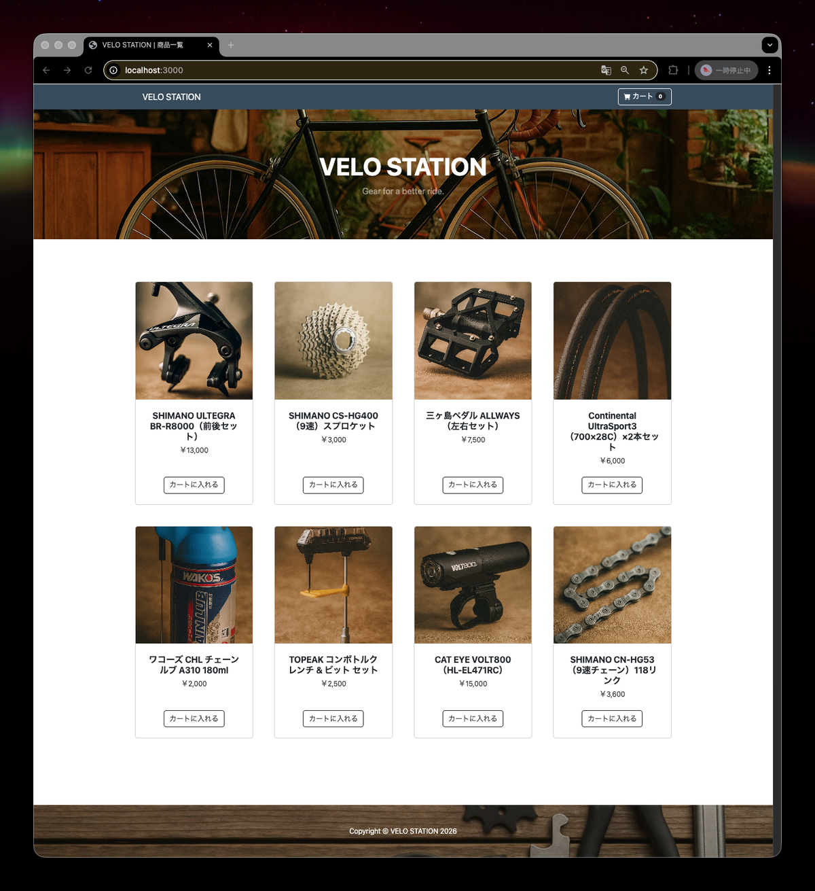
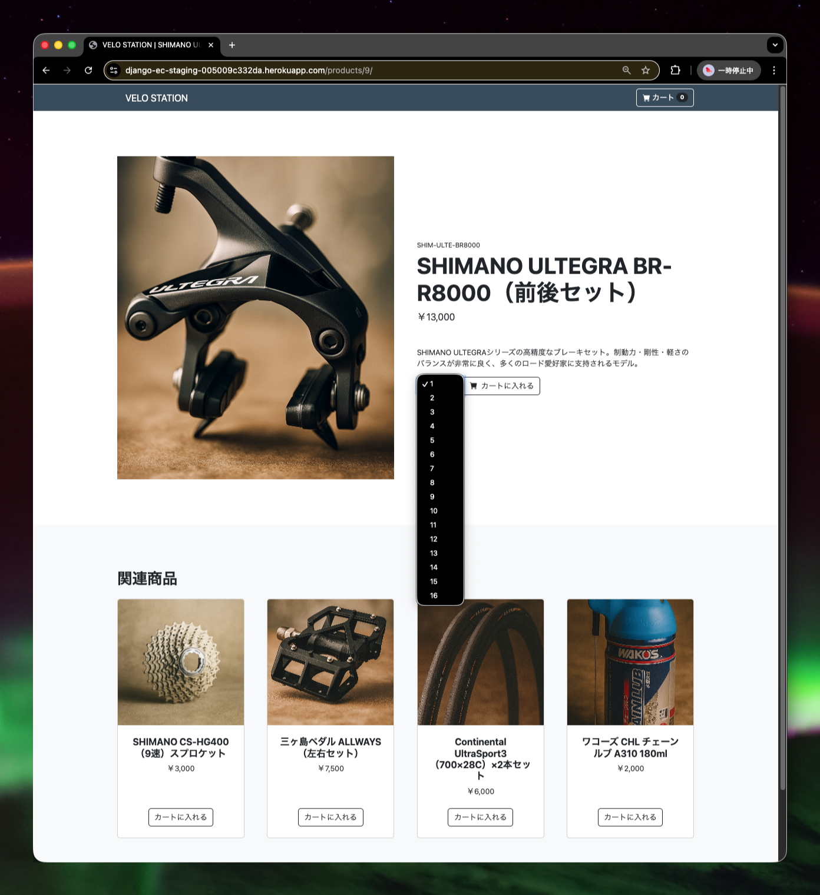
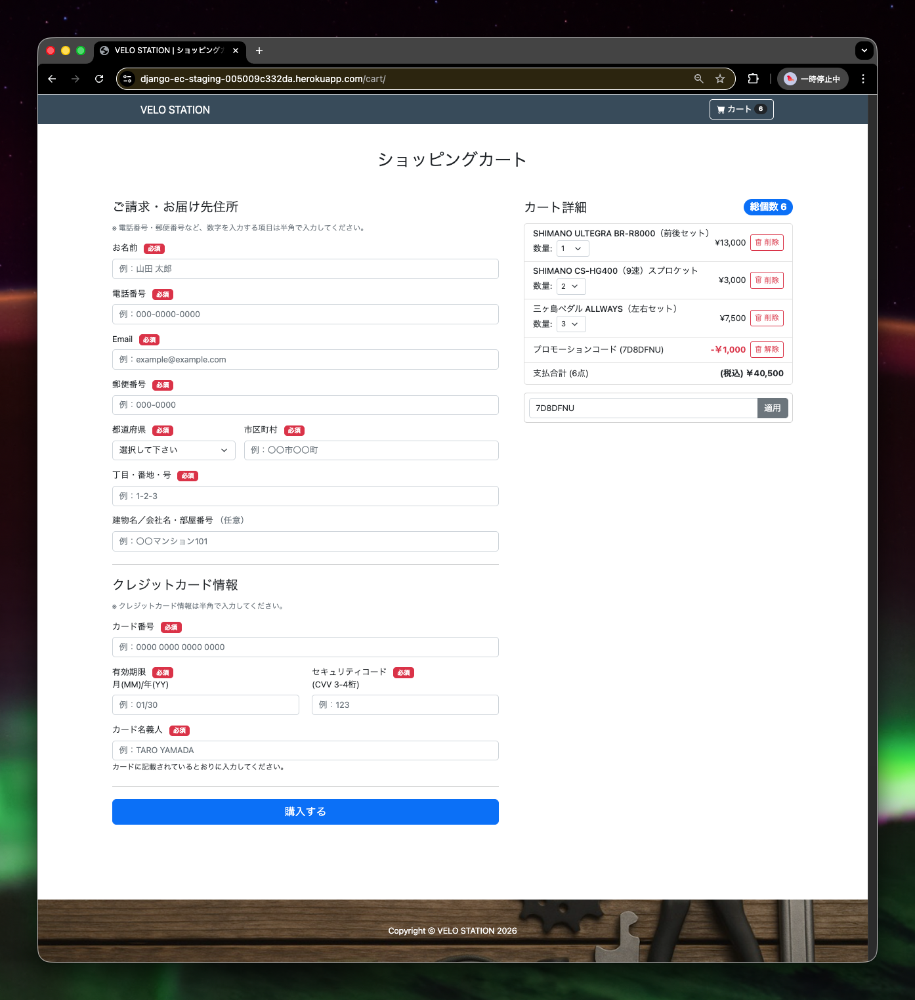
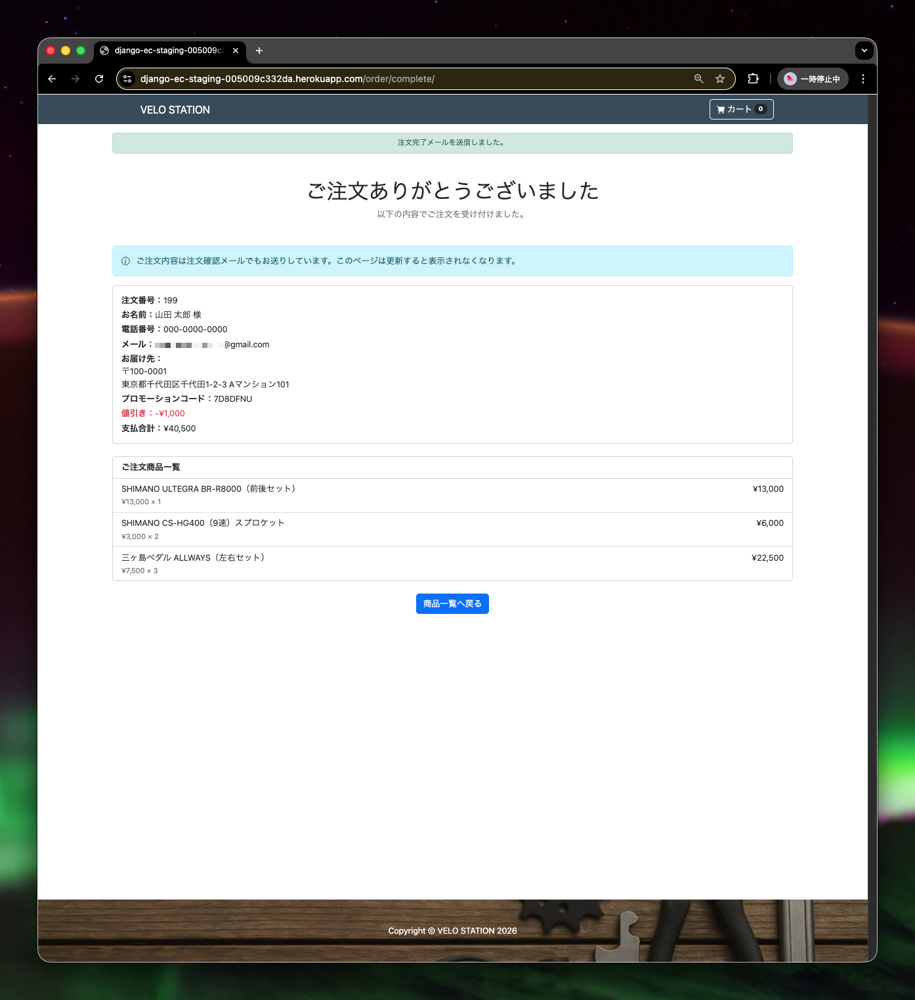
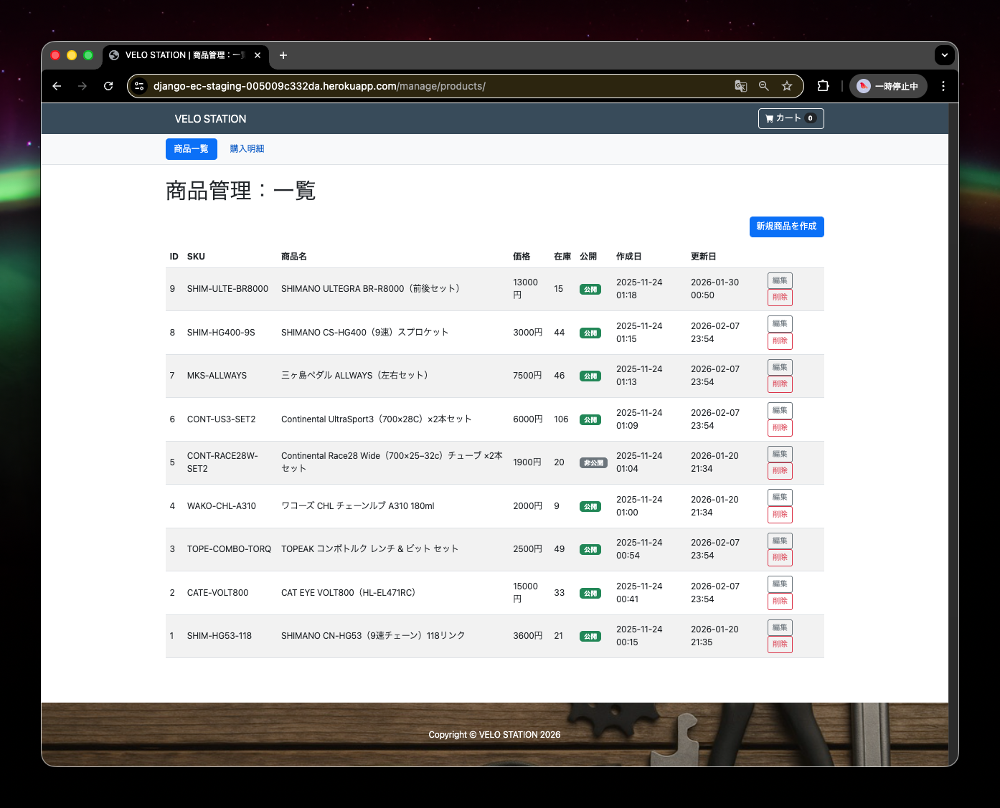
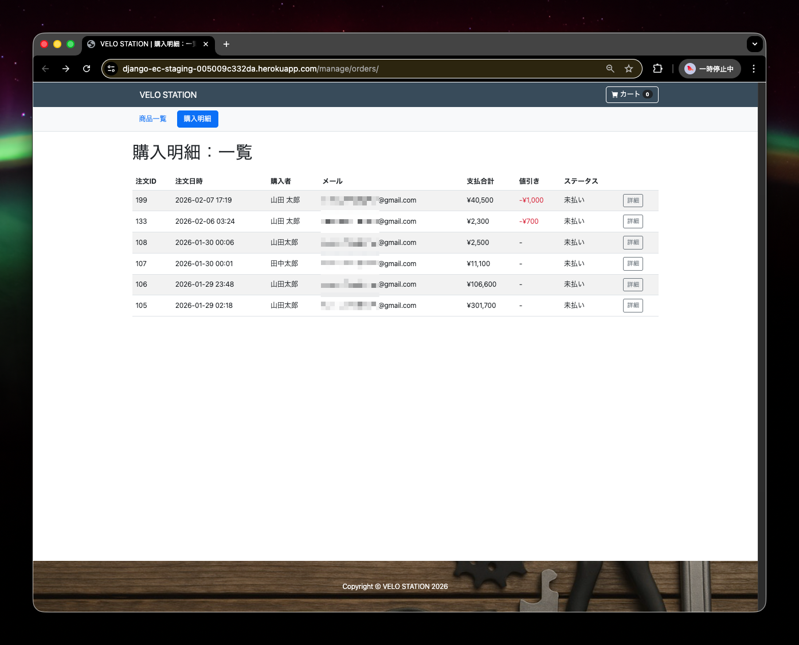
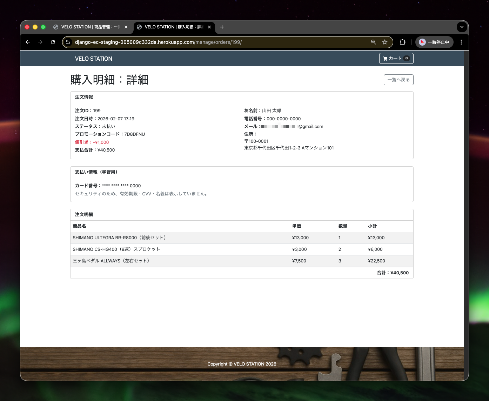
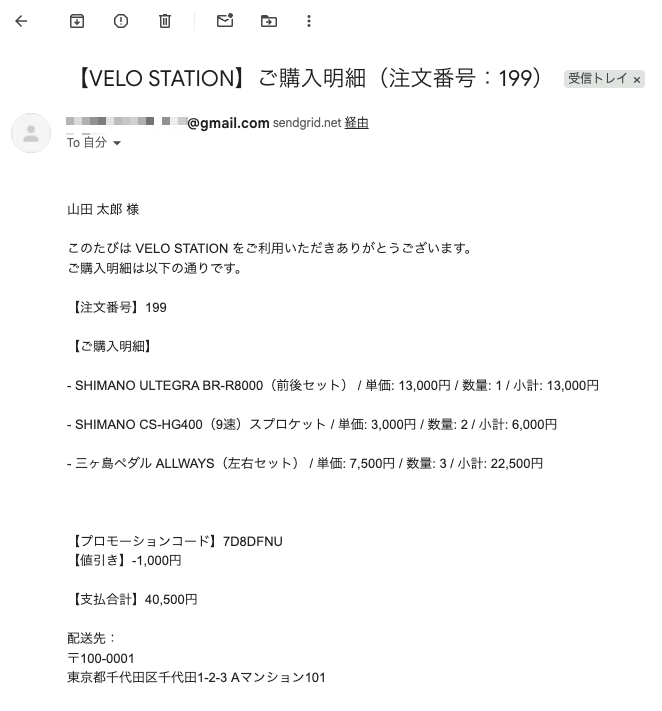

# VELO STATION（Django ECサイト / ポートフォリオ）

Djangoで作成したECサイトです。  
商品一覧 → カート → チェックアウト → 注文確定までの購入フローを一通り実装しています。

- デモURL：[https://django-ec-staging-005009c332da.herokuapp.com/](https://django-ec-staging-005009c332da.herokuapp.com/)
- ローカル起動：Docker対応（下に手順あり）
- 作者：nagai（GitHub: ngimixin）

---

## 技術スタック

- Python 3.12
- Django 4.2
- PostgreSQL
- Docker / Docker Compose
- Bootstrap（既存テンプレートをベースにUIを構築）
- Gunicorn + WhiteNoise（デプロイ環境で使用）
- Cloudinary（画像ストレージ）
- メール送信（SMTP 経由：SendGrid）
- Heroku

---

## できること（実装済み）

### お客様向け
- 商品一覧 / 商品詳細
- カート追加（一覧は +1、詳細は指定数量を追加）
- カート内の数量表示 / 削除
- チェックアウト（購入フォーム入力 → 注文確定）
- 購入後：購入完了画面にてフラッシュメッセージを表示
- 注文完了メール送信（購入明細を含む）
- セッション単位でカートを分離（ブラウザが違えば別カート）
- **プロモーションコード適用**
  - 7桁英数字のコードをカートで適用
  - 割引後の支払合計を即時反映
  - 適用中コードの解除が可能
  - 無効・使用済みコードはエラー表示
- チェックアウト画面のフロントバリデーション
  - 必須入力・文字数・形式（メール／郵便番号／カード情報）を送信前にチェック
  - サーバー側バリデーションと競合しない設計

### 管理者向け（/admin とは別に独自実装）
- 管理者用 商品管理ページ（`/manage/products`）
  - 商品一覧 / 作成 / 編集 / 削除（一覧から削除可能）
- 管理者用 注文一覧（`/manage/orders/`）
  - 注文詳細
  - プロモーションコード / 値引き額の確認
  - 購入者は閲覧不可
- 管理者向けページは Basic認証で保護

### Django admin
- 商品・注文・プロモーションコードの管理
- 注文詳細で金額・割引情報を確認可能
- 学習用のカード情報は readonly で表示

### データの整合性
- 商品情報を更新・削除しても、購入明細は「購入時点の情報」を保持
- プロモーション割引額も注文時点のスナップショットとして保持

---

## 工夫した点

- 購入フローの一連を実装（カート → チェックアウト → 注文作成 → 注文明細作成 → メール送信）
- セッション単位でカートを分離し、複数ユーザー同時利用でも混ざらない設計
- 注文・在庫・プロモーションコードは `select_for_update()` により行ロックし、同時実行時の不整合を防止
- プロモーションコードは管理コマンドで事前生成し、DBで管理。注文確定時に使用済みへ更新
- 割引額は注文金額を上限として適用し、マイナスにならないよう制御
- 割引額が 0 になる境界ケースも考慮し、DB制約・モデル・ドキュメントの整合を担保
- Django標準 admin に頼らず管理画面を独自実装し、Basic認証で保護
- カートの数量変更・削除・プロモーションコード適用は fetch（Ajax）で部分更新し、画面遷移なしで反映
- 商品一覧・カートの数量選択はプルダウン式にし、DBの在庫数を上限として反映
- 表示上の「合計金額」を「支払合計」に統一し、利用者・管理者双方で混乱しないUIに調整
- 郵便番号から住所を自動入力し、購入時の入力負担を軽減

---

## ローカル環境での起動方法


### .envを作成し、以下を記載

SECRET_KEYは自身で生成する

[【Django】settings.pyのSECRET_KEYを再発行(リジェネレート)する](https://noauto-nolife.com/post/django-secret-key-regenerate/)

```.env
DATABASE_URL="postgres://postgres:postgres@db:5432/django_develop"
SECRET_KEY=<自身で生成したものを使う>
DEBUG=True
ALLOWED_HOSTS=localhost,127.0.0.1,0.0.0.0
```

### dockerを立ち上げる

```
docker compose up
```

※ 以降の `docker compose exec` は、上記でコンテナ起動中であることが前提です。

### 初期データ（シード）を投入

※ ローカル環境で商品を表示する場合は、初期データ（シード）を登録してください。

```
docker compose exec web python manage.py migrate
docker compose exec web python manage.py loaddata products/fixtures/products.json
```

### 起動確認
ブラウザで以下にアクセスし、商品一覧画面が表示されれば起動完了です。

[localhost:3000/](http://localhost:3000/)

---

## 画面イメージ

#### 商品一覧


#### 商品詳細


#### カート・チェックアウト


#### 購入完了


#### 管理者向け 商品一覧


#### 管理者向け 注文一覧


#### 管理者向け 注文詳細


#### 購入確認メール（本文）
